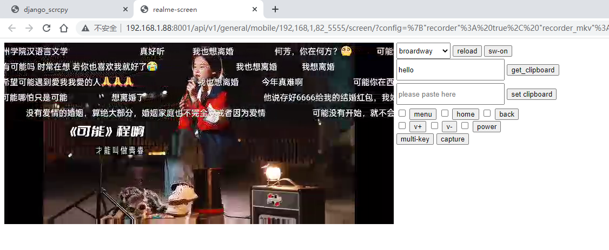
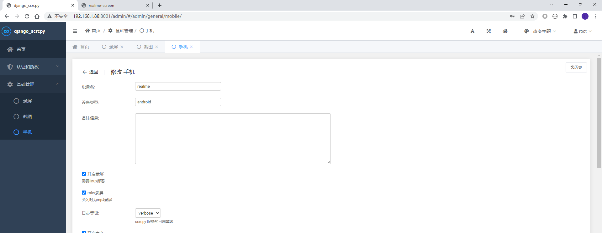
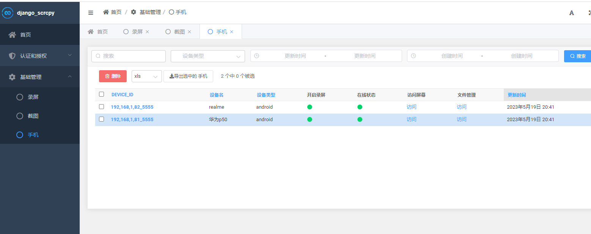
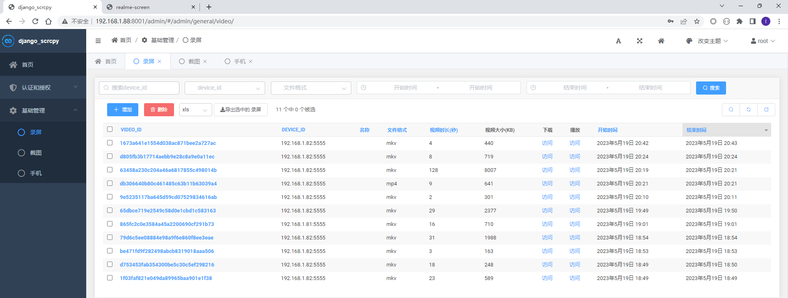
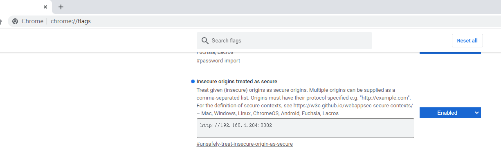

# 一.简介(What we can do)

  
手机web投屏和操控，支持音频，提供一个配置管理页用于配置各设备的投屏参数(帧率，尺寸等),支持多设备。  
Android Device remote display and control in browser page.audio support   
Provide manage site to configure display(frame-rate,screen-size,bit-rate), support multi devices.  
> _**QQ交流群: 696373448**_  
- web scrcpy
- file manage
- audio forward(Android>=11)
- recording (only linux)

# 二.原理(Summary) 
后端用scrcpy_server.jar获取手机h264流, 传输通过websocket(django高效异步)，前端broardway，webcodecs播放视频流并捕获鼠标事件完成操控。
电脑先配置好adb，手机设备打开usb调试并连接项目所在的电脑主机, 经测试在usb2.0, 720X336分辨率，800k比特率，25帧，本地浏览器延迟大概为60ms左右。   
Backend scrcpy_server.jar grab android-device screen-raw-h264 data.  
Transmission based on websocket (Django efficiently asynchronous coroutine).  
Frontend broardway.js play screen-raw-h264 data, capture mouse`s event to control.
We test in local browser[usb2.0, 720x336, 800kbit/s, 25fps] delay average 60ms.  
- **Django_scrcpy base on scrcpy https://github.com/Genymobile/scrcpy**
- **Webcodecs Inspired by https://github.com/yume-chan/ya-webadb**

# 三.运行(Usage)：
>Make sure adb server started and android-device(in Developer Mode) has connected to adb server.  
> `adb devices` in command line can list connected device.    
> _**List of devices attached**_   
> **_ba406a9e0421    device_**  
### 1.运行
- download project
- Install（项目升级时需要删除目录下db.sqlite文件，重新install）  
 `pip install -r requirements.txt`  
 `python init.py`
- Run（Visit http://127.0.0.1:8000/admin）  
`uvicorn django_scrcpy.asgi:application --host 0.0.0.0 --port 8000 --workers 4`
### 2.docker运行
- run  
    - linux  
    `docker run -it --name django_scrcpy --net=host -v some_dir:/usr/src/app/media -e DJANGO_SCRCPY_PORT=8000 lim1942/django_scrcpy:1.0`
    - macos/windows  
        _**【ADB_SERVER_ADDR can be "docker.for.mac.localhost" "host.docker.internal" "192.168.."】**_  
    `docker run -it --name django_scrcpy -v some_dir:/usr/src/app/media -p 8000:8000 -e ADB_SERVER_ADDR=docker.for.mac.localhost -e ADB_SERVER_PORT=5037 -e DJANGO_SCRCPY_PORT=8000 lim1942/django_scrcpy:1.0`  

- start  
`docker start django_scrcpy`
- stop  
`docker stop django_scrcpy`

# 四.webcodecs
由于浏览器安全限制，VideoDecorder, AudioDecorder需要在https或者本地localhost访问才能使用。  
webcodecs是浏览器的硬解码，解码速度和质量比broardway要好，但是兼容性不如broardway，很多浏览器不支持。
## 1.chrome关闭特定网址安全限制
浏览器输入 chrome://flag

在Insecure origins treated as secure中加入需要关闭安全限制站点，逗号分隔，配置好点击Relauch.重启后该站点可用webcodecs播放器了。

# 五.recoding
see [recoding support](extension/readme.md)
