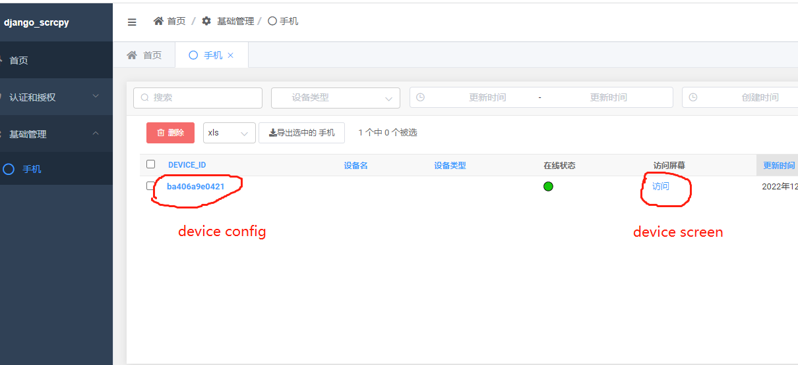

# 简介(What we can do)
实现安卓设备的web投屏和操控，提供一个配置管理页用于配置各设备的投屏参数(帧率，尺寸等),支持多设备。  
Android Device remote display and control in web page,   
provide admin site to config display(like frame-rate, screen-size, bit-rate), support multi devices.  

# 原理(Summary)
基于 **python3.7**, **django**异步, **scrcpy**。  
后端用scrcpy_server.jar获取手机h264流, 传输通过websocket(django高效异步)，前端broardway.js播放h264流并捕获鼠标事件完成操控。
电脑先配置好adb，手机设备打开usb调试并连接项目所在的电脑主机, 经测试在usb2.0, 720X336分辨率，800k比特率，25帧，本地浏览器延迟大概为60ms左右。  
Base on **python3.7**, **django**, **scycpy**.  
Backend use scrcpy_server.jar grab android-device screen-raw-h264 data.  
Transmission based on websocket (Django efficient asynchronous).  
Frontend use broardway.js play screen-raw-h264 data and capture mouse`s event to control.  
Please confirm adb server is started and android-device has connected to adb server,  
we test in local browser[usb2.0, 720x336, 800kbit/s, 25fps] delay average 60ms.

# 运行(Usage)：
>Make sure adb server started and android-device(in Developer Mode) has connected to adb server.  
> `adb devices` in command line can list connected device.    
> _**List of devices attached**_   
> **_ba406a9e0421    device_**
### 1. get_project
`git clone git@github.com:lim1942/django_scrcpy.git`  
`cd django_scrcpy`
#### 2. 安装依赖(Install project dependence)  
 `pip install -r requirements.txt`
### 3. 生成sqlite数据库表结构(Generate django database structure)  
 `python manage.py migrate`
### 4. 创建一个管理后台用户(Create admin site superuser)  
 `python manage.py createsuperuser`
### 5. 收集项目静态文件(Collect django static files)  
 `python manage.py collectstatic`
### 6. 运行项目(Deploy django project by daphne)  
 `daphne django_scrcpy.asgi:application -b 0.0.0.0 -p 8000`
### 7. 浏览器访问管理管登录管理手机(Visit admin site in chrome and login)  
 `http://127.0.0.1:8000/admin/`
